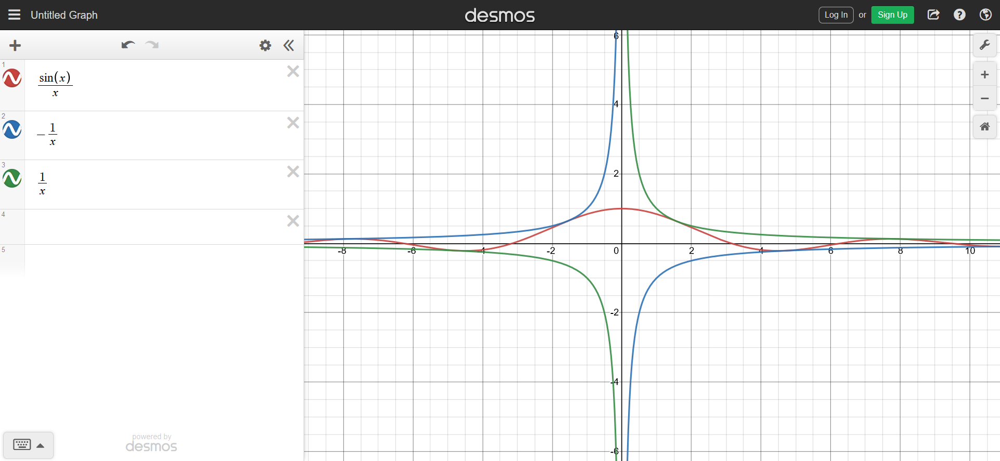
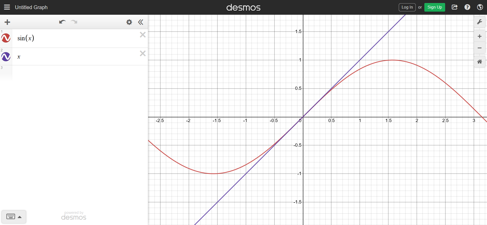

## sin(x)/x

Take 5 to 10 minutes to try and graph $\frac{\sin(x)}{x}$.

Then verify you drawing with a graphing tool like [Desmos](https://www.desmos.com/calculator).

Did you get it right ? Or are some parts completely off ? If so, can you imagine why they are the way they are ?

## Solution

First $\sin(x)$ varies between $-1$ and $1$, and therefore $\sin(x)\times\frac{1}{x}$ varies between $-\frac{1}{x}$ and $\frac{1}{x}$. Our graph will look like the graph of $\sin$, but it will be bounded by the graphs of $-\frac{1}{x}$ and $\frac{1}{x}$.

Then, around 0 : $sin(x)$ and $x$ are **very** similar (we say that they are *equivalent* and we write it $\sin(x) \sim x$)

And since dividing a number by itself gives $1$, $\frac{\sin(x)}{x} \approx 1$ as we get close to 0.

One objection might be that we are dividing by $x$ which is almost $0$, so the result should tend to infinity ; but actually since $\sin(x)$ is also very close to 0, they compensate each other and the result tends to 1 because $\sin(x) \approx x$.